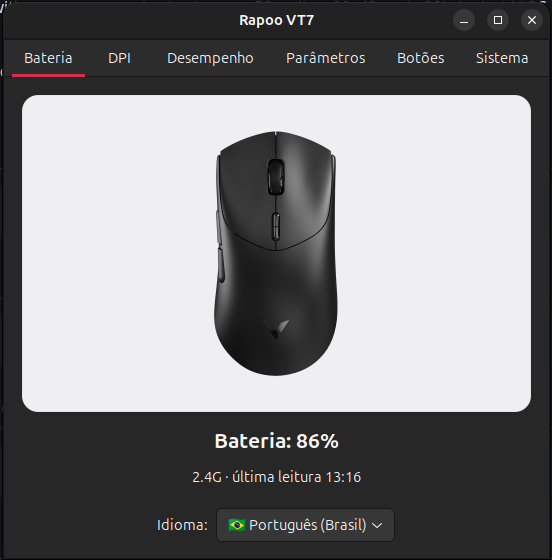

# Rapoo VT7 — Linux companion

Linux (GNOME) systray companion for the **Rapoo VT7** gaming mouse:
battery icon with percentage and color (green ≥50, yellow 20–49, red <20),
plus a configuration window — DPI gears, performance modes, polling rate,
button remap and system tools — speaking the mouse's native HID protocol
over direct hidraw (no hidapi).



## Features

- **Systray battery icon** — Material-style mouse + percentage, colored by
  level, charging bolt; low-battery notifications (20% / 10%)
- **Passive telemetry** — listens to the firmware's report 7 (battery,
  connection mode, DPI, polling rate) instead of polling; near-zero cost
- **Both connections** — 2.4G receiver (`24ae:1413`) and USB cable
  (`24ae:4613`), hot-swap aware
- **DPI tab** — active gear list (radio + per-gear X value, add/remove),
  synced live with the physical DPI button
- **Desempenho tab** — sensor modes (Office → Fury gaming), polling rate
  radios (125–8000 Hz), RF strategy, low-battery warning, glass tracking,
  debounce/sleep/angle/lift-off sliders
- **Botões tab** — remap all 13 buttons: functions, keyboard keys, combos,
  macro slots
- **Sistema tab** — device rename, guided receiver pairing, factory reset
- **i18n** — Portuguese / English interface
- Autostart support; protocol validated byte-for-byte against the official
  A Hub (`docs/FEATURES.md` has the full EEPROM map)

## Installation (once)

```bash
sudo ./install.sh
```

Installs GTK/AppIndicator dependencies and the udev rule granting the
`plugdev` group access to the hidraw devices.

## Run

```bash
./run.sh
```

## Diagnostics / development

```bash
python3 tools/probe.py            # battery, firmware, fields, cross-check
python3 tools/probe.py --status   # full registry read + report 7 mirror
python3 tools/probe.py --dump     # EEPROM baseline (golden gate for writes)
```

## Tests

```bash
python3 -m unittest discover -s tests
```

## Uninstall

```bash
./uninstall.sh
```

## Documentation

- **CONTEXT.md** — start here: project resume, deciphered protocol, state
- **docs/FEATURES.md** — full feature/EEPROM map + roadmap
