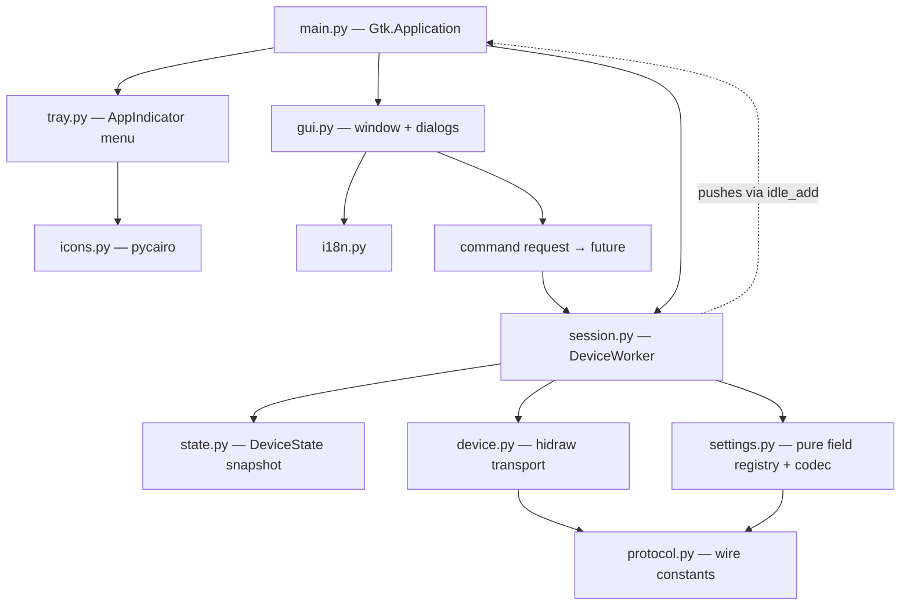

# Architecture Spine — Rapoo VT7 Linux app

## Design Paradigm

**Layered, callback/push with a single device producer.** The **device session**
(one worker thread) is the sole producer: it owns the hidraw fd, routes every
report, and pushes an immutable state snapshot upward. The presentation layer
(GTK + AppIndicator) consumes that state and issues configuration requests
downward through a command queue. Dependency direction is strictly downward —
presentation → core (session/settings) → transport (device/protocol) — and no
module reaches around its layer.

## Invariants & Rules



### AD-1 — Layered single-producer push architecture

- **Binds:** all capabilities
- **Prevents:** modules reaching around layers to touch hidraw or wire bytes; the GUI becoming a second I/O owner
- **Rule:** dependency direction is downward only — presentation → core (session/settings) → transport (device/protocol). Only `device.py` performs hidraw syscalls; only `protocol.py` holds wire constants and offsets. The worker is the sole producer of device state; GUI modules never open or write the device.

### AD-2 — One worker loop routes every report; one command in flight

- **Binds:** CAP-1, CAP-2, CAP-3, CAP-5, CAP-6
- **Prevents:** dropped passive reports (rid 7) while a command is in flight; two readers racing; a late/duplicate ACK completing the wrong future
- **Rule:** a single `select` loop owns reading. Exactly **one command is in flight at a time** (the wire carries no per-command correlation, so ordering must be total): further requests queue FIFO. Routing: rid 6 ACK completes the pending command; rid 7 updates the snapshot and notifies consumers; `06 00` is a **sleep signal** routed to the state machine; anything else is ignored. An ACK with no pending command is **dropped and counted** (surfaced in state), never buffered for the next command; a late ACK after a timeout never completes a future. No other code path reads from the fd.

### AD-3 — Worker owns the fd, the queue, and hot swap; writes are single-execution

- **Binds:** CAP-2, CAP-3, CAP-4, CAP-5, CAP-6, CAP-7, CAP-8
- **Prevents:** busy-fd conflicts inside the app; GTK main loop blocking on device I/O; two mutators; latent double-writes to EEPROM across a hot swap
- **Rule:** exactly one fd is open at a time inside the app process, owned by the worker. User actions enqueue a command request returning a future; results are delivered via `idle_add`; futures resolve **exactly once** (success, `CommandTimeout`, `Cancelled` on quit, `DeviceGone` on disconnect). GUI code never calls `os.open`/`write`/`read` on a hidraw and never waits on device I/O. Hot swap is owned by the worker: the transport's auto-retry (`device.query` interface replay) is **retired**; a command spanning an interface switch is **not replayed** — it resolves typed with the interface-change reason. Writes are single-execution; the AD-6 re-read is the safety net.

### AD-4 — Device state is one immutable snapshot with declared field semantics

- **Binds:** all capabilities
- **Prevents:** partial-state renders; two owners of one field; conflation of work-mode with connection-mode; a write-verify re-read losing to a stale report 7
- **Rule:** the worker publishes a single immutable `DeviceState`. Every field has a declared source and precedence per the table below; fields carry **raw device values** (indexes/offsets); all presentation mapping (Hz, labels, DPI) lives in the GUI layer. A write-verify re-read **supersedes** report-7 data for that field until a newer report 7 with a different value is observed. On `asleep`/`disconnected`, the last-known values are **retained**, never nulled.

| Field | Source | Type / range | Notes |
| --- | --- | --- | --- |
| `connect_mode` | report 7 `data[1]` low nibble | int 0–2 | 0 2.4G, 1 BT, 2 USB — tray label |
| `work_mode` | 0xA2 reply `data[2]` | int (raw, e.g. 0x11) | **distinct** from connect_mode |
| `battery` | report 7 `data[8]` / 0xAA reply | int 0–100 | |
| `status` | report 7 `data[7]` / 0xAA reply | 0 invalid, 1 ok, 2 charging | |
| `dpi_gear` | report 7 `data[2]` | int (raw index) | write-verify supersedes |
| `dpi_x`, `dpi_y` | report 7 `data[3..4]`/`[5..6]` | int LE (raw) | |
| `rpt_24g`, `rpt_usb` | report 7 `data[10]`/`[11]` | int (raw index, not Hz) | Hz mapping deferred to Phase 3, in presentation |
| `config` | report 7 `data[12]` | int (raw byte) | verbatim, never parsed by core |
| `asleep` | derived (empty report / timeout) | bool | retained state, not a device field |

### AD-5 — Threading boundary: GTK main loop vs worker thread

- **Binds:** all capabilities
- **Prevents:** UI mutation off the main thread; device I/O on the UI thread
- **Rule:** the worker is the only device thread; the Gtk main loop is the only UI thread. All crossings are asynchronous: pushes via `GLib.idle_add`, command results via futures marshalled to `idle_add`. No blocking waits and no locks in UI code.

### AD-6 — settings.py is a pure registry + codec; the worker is the sole golden-rule executor

- **Binds:** CAP-4, CAP-5, CAP-6, CAP-7, CAP-8
- **Prevents:** raw EEPROM addresses leaking into the GUI; unverified or unbacked writes; settings opening its own fd; read-modify-write interleaving with a poll
- **Rule:** `settings.py` is pure metadata + codec — `Field(addr, size, type, range, validator)` plus encode/decode, no `device` import, no I/O, no GTK. It stores raw bytes and `size`/`type` as **data**, so Phase-1 format corrections are data edits, not code changes. The **worker is the only executor** of the golden rule (baseline exists → write → verify by re-read) operating on `Field` metadata through the command queue; a read-modify-write is **one atomic queue entry**. Baseline: `~/.cache/rapoo-vt7/eeprom_baseline.json`, shared constant consumed by the worker and `probe.py --dump`. GUI and probe share the registry; neither executes I/O.

### AD-7 — GUI-only user surface + i18n + icon naming

- **Binds:** CAP-1, CAP-5, CAP-6, CAP-7, CAP-8
- **Prevents:** CLI-only features; unlocalized strings; theme-name icon resolution failures; two sources of truth for icon filenames
- **Rule:** every user-manipulable feature is reachable from the menu or a dialog; every user string lives in `i18n.LANGS` (pt_BR/en/es); icons are rendered by pycairo to an absolute PNG path passed to `set_icon_full`; `icons.py` is the **sole owner** of icon-name derivation (`icon_name`/`UNKNOWN_NAME`) — no other module inlines the filename pattern.

### AD-8 — Error model and sleep discipline

- **Binds:** CAP-3, CAP-4, CAP-5, CAP-6, CAP-7, CAP-8
- **Prevents:** blocking error dialogs; command flood while the mouse sleeps; the sleep FSM being dropped in the session migration
- **Rule:** device failures raise typed exceptions (`DeviceNotFound`/`DeviceOpenError`/`CommandTimeout`) mapped to states (connected/asleep/disconnected/error/reconnecting); GUI surfaces errors as notifications or dialogs without blocking the loop. Asleep keeps the listen-only discipline — 0xAA only on first connect and after the fallback timeout, quiet-listen with the 60 s reopen otherwise (the existing FSM migrates **verbatim** into the session, command queue added; a story cannot drop the quiet-reopen behavior). **User commands while asleep are queued but not sent**; the queue drains FIFO on wake (first report 7); a pending user command surfaces non-blocking as "pending — move the mouse"; manual Refresh is the explicit wake path.

### AD-9 — CLI is a separate process; the app holds one fd

- **Binds:** CAP-4, diagnostics
- **Prevents:** the app opening a second concurrent fd; the worker being driven by the CLI; probe and app disagreeing on the baseline file
- **Rule:** `tools/probe.py` opens its own device for diagnostics/validation (`--dump`, `--status`); the app process never instantiates a second fd while the worker's is open. `probe.py --dump` and the worker's golden-rule check consume the **same shared baseline-path constant**.

### AD-10 — Config ownership and ops envelope

- **Binds:** all capabilities, persistence
- **Prevents:** `save_language` clobbering other keys; two threads racing on `config.json`; a second app process opening a second fd
- **Rule:** `config.json` has a single owner performing atomic read-modify-write replace (never a blind `{"language": ...}` write). The GApplication **single instance** + `--hidden` + autostart is the ops envelope — it is what prevents a second fd from another process; a story cannot drop single-instance behavior.

## Consistency Conventions

| Concern | Convention |
| --- | --- |
| Naming (files, interfaces, events) | flat modules under `src/rapoo_vt7/`; one file per layer (protocol, device, session, state, settings, tray, gui, icons, i18n, config, main); snapshot fields snake_case on `DeviceState`; `connect_mode` vs `work_mode` never conflated |
| Data & formats (ids, errors, envelopes) | report constants/offsets only in `protocol.py`; EEPROM addresses 2-byte LE, bank 0; snapshot carries raw device values (presentation maps); persistence in `~/.config/rapoo-vt7/config.json` via atomic replace; baseline path is a shared constant; errors are typed exceptions |
| State & cross-cutting (mutation, errors, logging, config) | one producer (worker) → one snapshot; mutation only in the worker; link status via `on_state`; all user strings via `i18n`; golden rule executed only by the worker |

## Stack

Seeded from the running install (ratified, not prescribed).

| Name | Version |
| --- | --- |
| Python | 3.14.4 (Ubuntu 26.04 LTS) |
| GTK | 3.24.52 |
| AyatanaAppIndicator3 | 0.1 (GIR namespace) |
| pycairo | 1.27.0 |
| unittest | stdlib — `python3 -m unittest discover -s tests` |
| hidraw (kernel hid-generic) | udev rule `24ae:1413\|24ae:4613`, `MODE="0664" GROUP="plugdev"` |

## Structural Seed

```text
src/rapoo_vt7/
  main.py        # Gtk.Application: wiring, idle_add bridge, single instance, --hidden
  tray.py        # AppIndicator + menu (user surface, absolute PNG path)
  gui.py         # BatteryWindow + future dialogs (DPI, params, remap, system)
  icons.py       # pycairo icon renderer + PNG cache (~/.cache/rapoo-vt7/icons)
  session.py     # DeviceWorker: fd owner, report router, command queue  (evolves battery.py, FSM verbatim)
  state.py       # DeviceState: immutable snapshot with field semantics    (new, Phase 2)
  device.py      # RapooDevice: hidraw transport, scan, hot-swap switch (auto-retry retired)
  protocol.py    # wire constants, offsets, EEPROM addresses
  settings.py    # pure field registry + codec; golden rule is worker-side (new, Phase 0)
  config.py      # config.json atomic read-modify-write
  i18n.py        # LANGS (pt_BR/en/es) + tr()
tools/probe.py   # diagnostics/validation CLI (--dump, --status); separate process
tests/           # unittest: FakeDev / FakeClock / Collector injection
```

## Capability → Architecture Map

| Capability / Area | Lives in | Governed by |
| --- | --- | --- |
| CAP-1 Battery indicator | `session.py`, `tray.py`, `icons.py` | AD-2, AD-4, AD-7, AD-8 |
| CAP-2 Both connections / hot swap | `device.py`, `session.py` | AD-2, AD-3 |
| CAP-3 Link / sleep handling | `session.py` | AD-2, AD-3, AD-8 |
| CAP-4 EEPROM infrastructure | `device.py`, `settings.py`, `session.py`, `tools/probe.py` | AD-3, AD-6, AD-9, AD-10 |
| CAP-5 DPI control | `settings.py`, `session.py`, `tray.py`/`gui.py` | AD-2, AD-4, AD-6, AD-7 |
| CAP-6 Performance / parameters | `settings.py`, `session.py`, `tray.py`/`gui.py` | AD-2, AD-4, AD-6, AD-7 |
| CAP-7 Button remap | `settings.py`, `session.py`, `gui.py` dialogs | AD-6, AD-7 |
| CAP-8 System operations | `device.py`/`settings.py`, `session.py`, `gui.py` dialogs | AD-6, AD-7, AD-8 |

## Deferred

- **EEPROM field formats (1B vs 2B LE)** — Phase 1 story S3; harmless because the registry stores `size`/`type` as data (AD-6), so corrections are data edits.
- **Button-remap function codes** — Phase 4; extraction method (A Hub diff) is a story decision.
- **Polling index→Hz map** — Phase 3 story; safe because snapshots store raw indexes and mapping lives in presentation (AD-4).
- **DPI physical-button behavior** (device-side gear switching vs menu-only) — product open question; the AD-4 precedence rule already resolves the stale-display axis (device-side change via report 7 beats a command-derived value).
- **Packaging/distribution** (deb/flatpak) — scripts only for now.
- **A settings window beyond menu + dialogs** — explicit non-goal of the spec.
- **Firmware update / macros** — non-goals of the spec.
